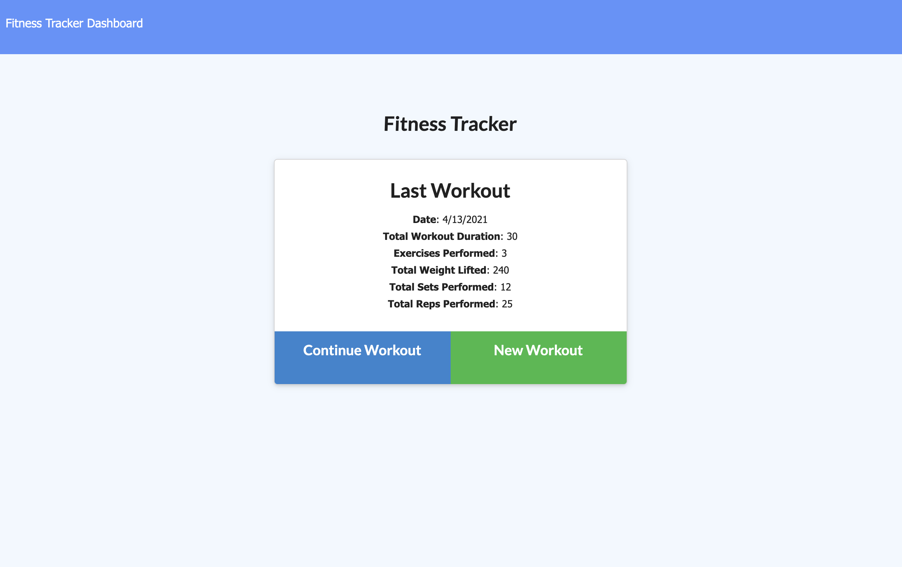
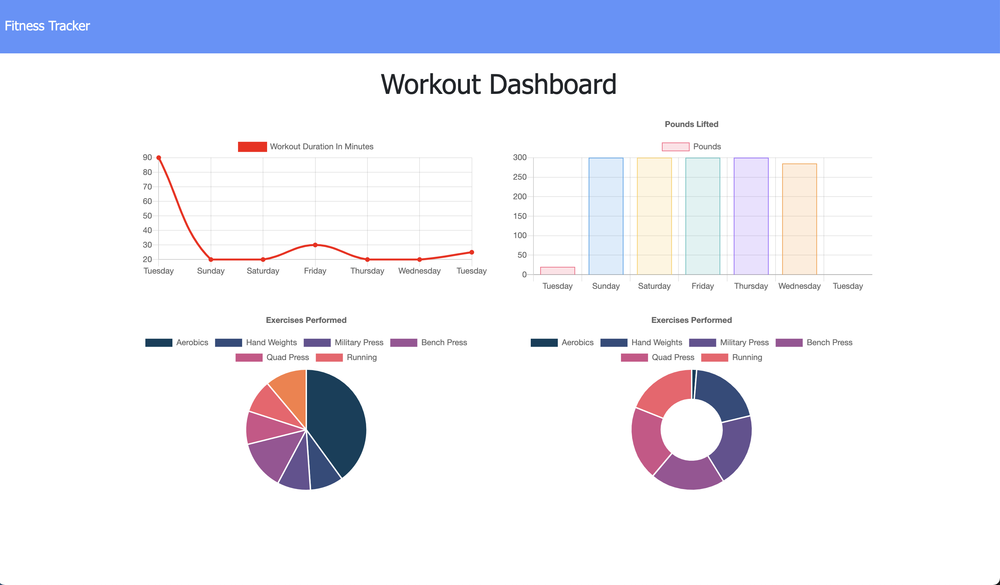

# Personal Fitness Tracker
An application to help you manage, track, and plan your fitness routine.


## Description

A personal fitness tracker allowing the user to input their daily workout routine and track their progress. Users can view their longest durations, most weights used, and the variety of exercises they completed over seven days.

## Table of Contents

* [Reference](#reference)
* [Details](#details)
* [Technologies](#technologies)
* [Installation](#installation)
* [Usage](#usage)
* [License](#license)
* [Contributing](#contributing)
* [Questions](#questions)
  
## Reference

Click [here](https://personal-fitnesss-tracker.herokuapp.com/?id=6075e370ebdd9600154845ac) to view the live application on Heroku.

Screenshot of homepage
  

Screenshot of stats page
  

## Details
  * Homepage will users most recent workout stats or, if no information is provided, will prompt the user to create a new workout.
  * Clicking "New Workout" allows the user to create a new workout set.
  * Clicking "Continue Workout" will allow user to add new exercises to a current workout.
  * "Add Exercise" will add the exercise to the object array and prompt you to create another exercise.
  * "Complete" will add the exercise to the object array and complete the workout.
  * Clicking on the dashboard will allow you to view the statistics for this weeks workouts, including longest durations, most weights used, and the variety of exercises completed over seven days
  
## Technologies
Technologies used: CSS, JavaScript, MongoDB, Mongoose, Express, dotenv.

## Installation

To install all necessary materials for this project, run the following command:

```
npm install
```

## Usage

Be sure to install all node modules and packages locally before using the application, and to create a .env with your information. Seeds are provided if you need to test or rearrange the application.

## License

This application is protected under the MIT license.

For more information, visit this link: [MIT Info](https://opensource.org/licenses/MIT)

## Contributing
Design may be changed to the contributors needs and taste.

## Questions

If you have any questions, please reach out.
* GitHub: [AHFotis](https://github.com/AHFotis)
* Email: annahickey2@gmail.com